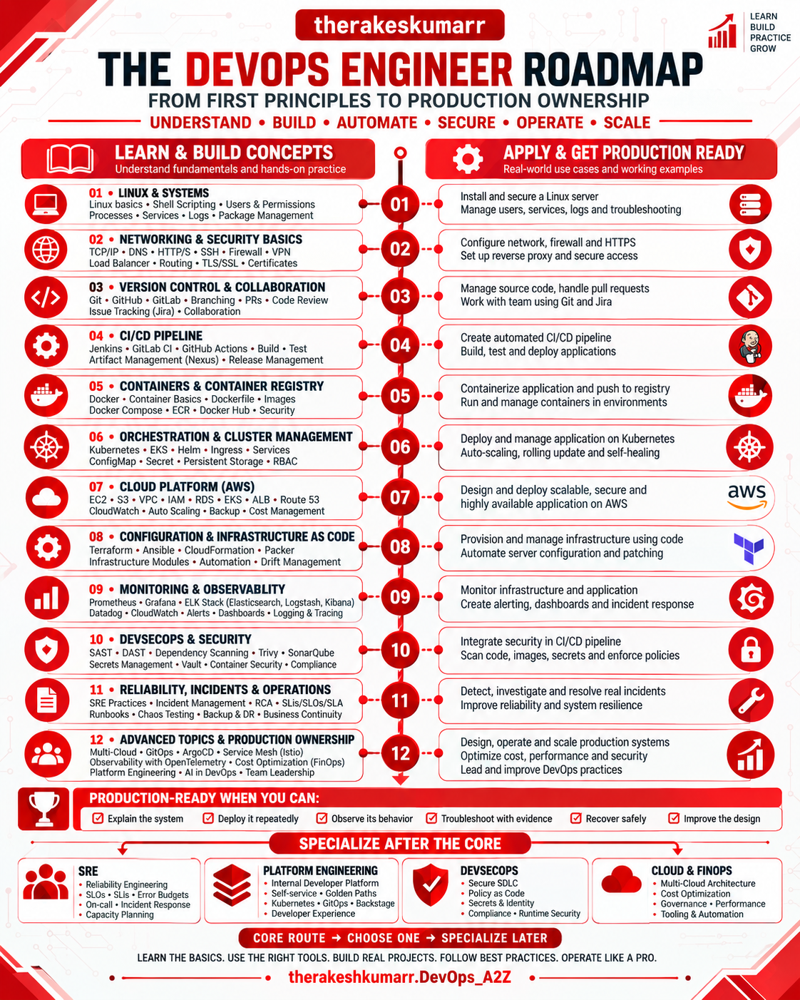

# DevOps Engineer Roadmap

# Welcome To My DevOps & DevSecOps Learning Repository
## DevOps_A2Z

**A structured, production-focused learning hub for DevOps and modern infrastructure engineering.**

[Start learning](#start-learning) · [Explore the repository](#explore-the-repository) · [Build projects](#learn-by-building) · [Contribute](CONTRIBUTING.md)

---

## What you will learn

DevOps_A2Z helps you understand how modern systems are built, delivered, secured, observed, and operated. It connects individual tools to the engineering decisions behind reliable production systems.

The repository covers:

- Linux, networking, Git, and scripting
- Cloud platforms and infrastructure as code
- Docker, Kubernetes, Helm, and GitOps
- CI/CD, release engineering, and automation
- Monitoring, logging, tracing, and incident response
- DevSecOps, platform engineering, SRE, and production operations
- Hands-on projects, troubleshooting scenarios, and interview preparation

This is not a list of tools to memorize. The goal is to learn how systems behave, how they fail, and how engineers operate them responsibly.

## Who this repository is for

| If you are... | Use DevOps_A2Z to... |
|---|---|
| New to DevOps | Follow the learning path in order and complete the labs |
| Building a portfolio | Create production-style projects and document your decisions |
| Preparing for interviews | Review concepts, scenarios, troubleshooting, and system design |
| Already working in infrastructure | Use the handbooks, incident cases, and reference material |
| Contributing to open source | Improve technical accuracy, labs, documentation, and diagrams |

## Start learning

Follow the stages in order if you are new. If you already have experience, start at the stage that matches your current gap.

| Stage | Focus | Outcome |
|---|---|---|
| 1 | Linux, networking, Git, Bash, Python, YAML, JSON | Work confidently from the command line and understand system fundamentals |
| 2 | Cloud, web servers, databases, Docker | Build and run foundational infrastructure and containerized applications |
| 3 | Terraform or OpenTofu, Ansible, CI/CD | Provision infrastructure and automate delivery |
| 4 | Kubernetes, Helm, managed Kubernetes, GitOps | Deploy and manage containerized workloads at scale |
| 5 | Metrics, logs, traces, alerting, SRE | Observe systems and measure reliability |
| 6 | Availability, scaling, incidents, recovery | Operate and troubleshoot production systems |
| 7 | IAM, secrets, supply-chain security, policy as code | Apply security throughout the delivery lifecycle |
| 8 | Platform engineering, FinOps, governance, AIOps | Explore advanced infrastructure specializations |

### Begin with the foundations

1. [Computer fundamentals](03.%20LEARNING%20RESOURCES/01.%20Computer%20Fundamentals)
2. [Linux](03.%20LEARNING%20RESOURCES/02.%20Linux)
3. [Networking](03.%20LEARNING%20RESOURCES/03.%20Networking)
4. [Git and GitHub](03.%20LEARNING%20RESOURCES/04.%20GIT%20%26%20GITHUB)
5. [Bash and shell scripting](03.%20LEARNING%20RESOURCES/05.%20Bash%20and%20Shell%20Scripting)
6. [YAML and JSON](03.%20LEARNING%20RESOURCES/06.%20YAML%20and%20JSON)
7. [Python for automation](03.%20LEARNING%20RESOURCES/07.%20Python%20for%20Automation)

> Choose one tool when several tools solve the same problem. Learn the principle first, then learn another tool when a project or role requires it.

## The engineering path

`Foundations → Cloud → Containers → Infrastructure as Code → CI/CD → Kubernetes → Observability → Security → Production Operations`

At every stage:

1. Learn the concept.
2. Build a small working system.
3. Verify its behavior.
4. Break it deliberately.
5. Troubleshoot with evidence.
6. Document the failure and recovery.
7. Explain what would change in production.

## Explore the repository

| Area | What to expect |
|---|---|
| Learning resources | Structured concepts, commands, examples, and foundational lessons |
| Projects and labs | Guided builds with verification, failure testing, and cleanup |
| Engineering handbooks | Focused references for tools, platforms, and operational practices |
| Troubleshooting | Symptom-led diagnosis, evidence collection, fixes, and prevention |
| Production incidents | Realistic failure scenarios, investigation paths, and lessons learned |
| Interview preparation | Technical questions, scenarios, system design, and practical exercises |

> Repository sections are expanded continuously. Some topics may be planned or under active development.

## Learn by building

A strong project should show more than a list of successful commands. Where relevant, include:

- The problem and intended outcome
- Architecture and major decisions
- Prerequisites and reproducible setup
- Configuration and commands
- Expected output and verification checks
- Security and cost considerations
- Common mistakes and failure scenarios
- Troubleshooting evidence and recovery steps
- Production trade-offs
- Cleanup instructions

Use the project as evidence that you can reason about a system, not only deploy it.

## Engineering principles

Ask these questions while you learn:

- What is happening inside the system?
- Why does this component exist?
- What depends on it?
- How can it fail?
- What evidence would reveal the failure?
- How would I contain, recover from, and prevent it?
- Would this approach be safe and maintainable in production?

## Contributing

Contributions are welcome when they improve accuracy, clarity, safety, or practical value.

Good contributions include:

- Correcting technical errors or broken links
- Improving explanations and diagrams
- Adding reproducible labs or troubleshooting cases
- Updating obsolete commands or practices
- Adding official documentation and trustworthy references
- Improving accessibility, navigation, and consistency

Before opening a pull request, read [CONTRIBUTING.md](CONTRIBUTING.md). By participating, you agree to follow the [Code of Conduct](CODE_OF_CONDUCT.md).

## Security

Do not open a public issue for a security vulnerability or accidentally exposed secret. Follow [SECURITY.md](SECURITY.md) instead.

## Support

For learning questions, bug reports, and repository help, see [SUPPORT.md](SUPPORT.md). Please use the correct issue template so maintainers have enough information to respond.

## 🛠️ Author
This project is maintained by **[Rakesh Kumar Sahoo](https://github.com/therakeshkumarr)** 💡
Your feedback and contributions are welcome!

📧 **Connect with me:**
- **GitHub**: [Rakesh Kumar Sahoo](https://github.com/therakeshkumarr)
- **LinkedIn**: [Rakesh Kumar Sahoo](https://www.linkedin.com/in/therakeshkumar/)

---

## ⭐ Support the Project

If you found this project helpful, please consider:
- **Starring** ⭐ the repository
- **Sharing** it with your network
- **Contributing** to its improvement

---
**Learn. Build. Break. Troubleshoot. Secure. Improve.**
